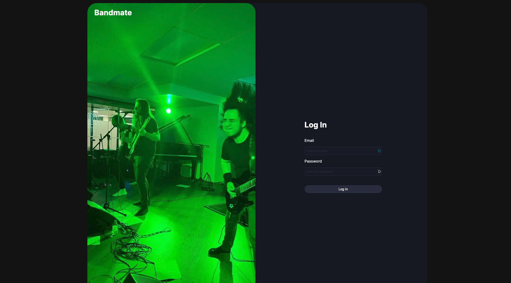
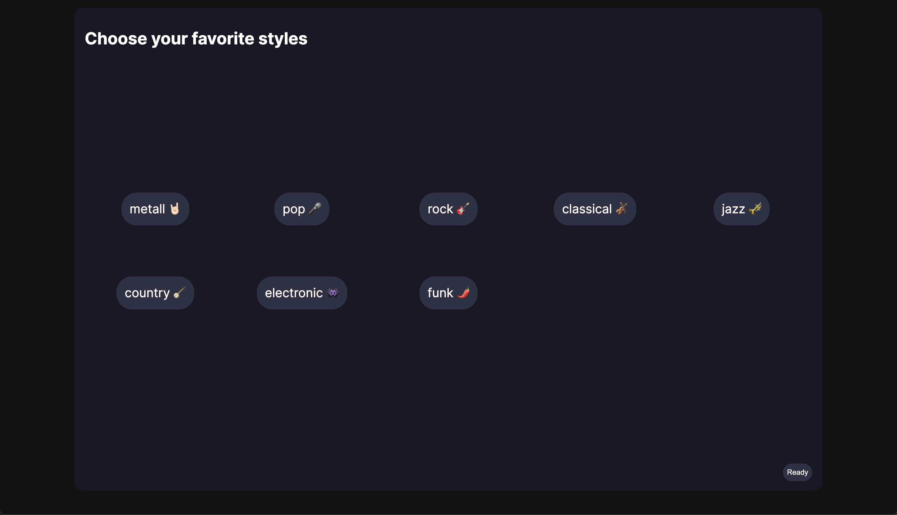
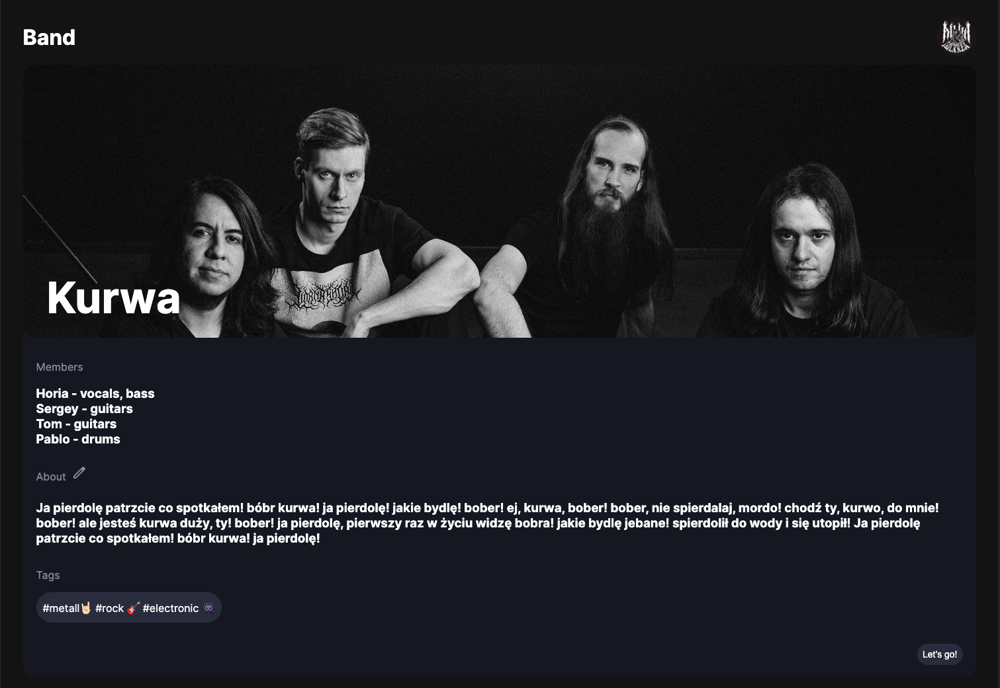
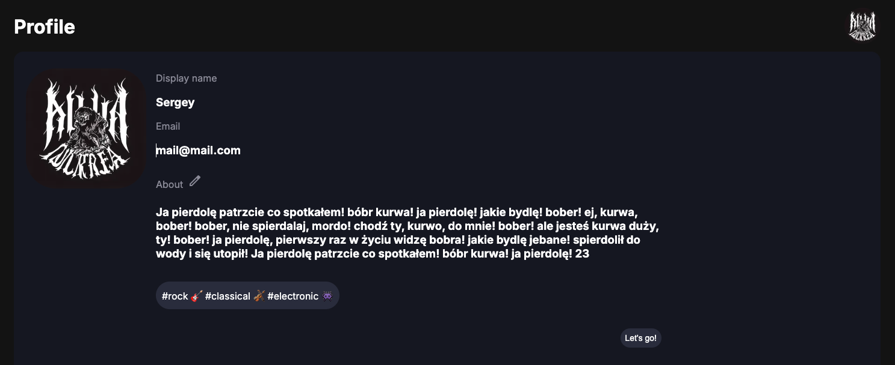
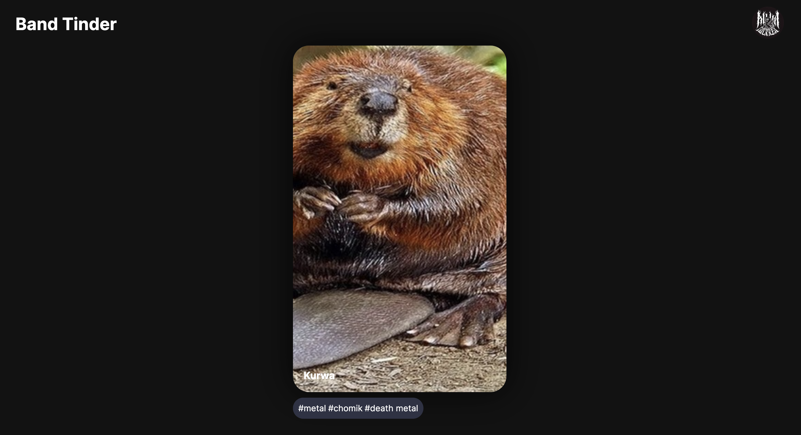

# Bandmate

Discover and connect with local musicians and bands using a Tinder-like swipe mechanic to find your perfect musical match.

## Table of Contents

-   [Features](#features)
-   [Pages](#pages)
-   [Technologies](#technologies)
-   [Tests](#tests)

## Features

1. User profile creation with personalized music interests
2. Swipe through profiles of musicians and bands
3. Like bands and musicians to express interest
4. View detailed profiles of bands and musicians
5. Receive notifications when someone likes your band or profile

## Pages

### Login/Signup



### Styles



### Band



### Profile



### Tinder



### Notifications


## Technologies

-   **Frontend:** [Next.js](https://nextjs.org/), [React](https://react.dev/)
-   **Database:** [Firebase Firestore](https://firebase.google.com/docs/firestore)
-   **Authentication:** [Firebase Authentication](https://firebase.google.com/docs/auth)
-   **State management:** [Redux](https://redux.js.org/)
-   **UI Testing:** [Playwright](https://playwright.dev/)
-   **Tinder Swipe mechanic:** [React Tinder Card](https://github.com/3DJakob/react-tinder-card)

## Tests

UI tests are done in Playwright using page object pattern. In addition to main flows, all pages are checked for the presence of elements.

-   Open Log In page
-   Log In
-   Open Sign Up page
-   Sign Up
-   Open Profile page
-   Open Tinder page
-   Swipe mechanic

### Running UI tests

```bash
# run UI tests
npx playwright test

# report
npx playwright show-report
```
